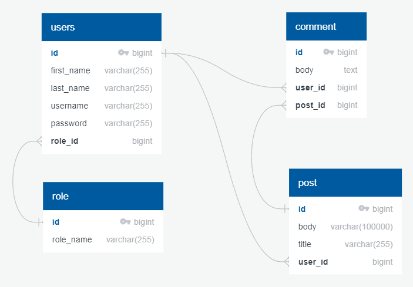
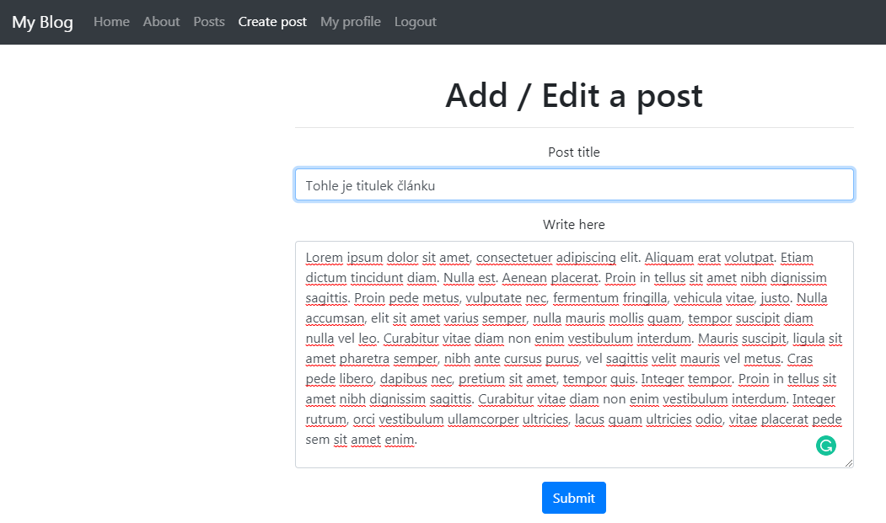
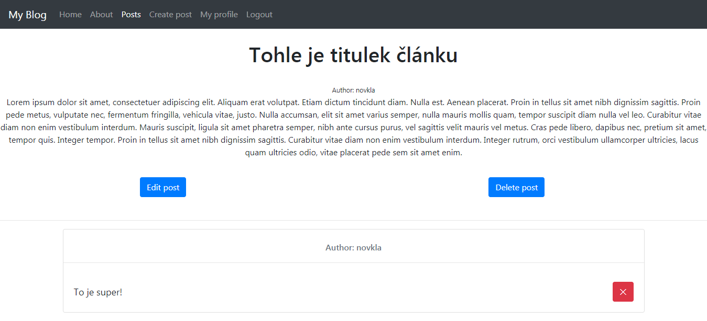
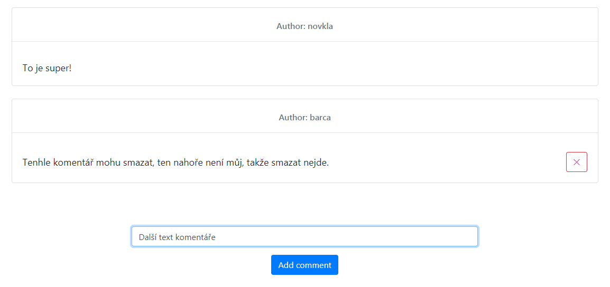
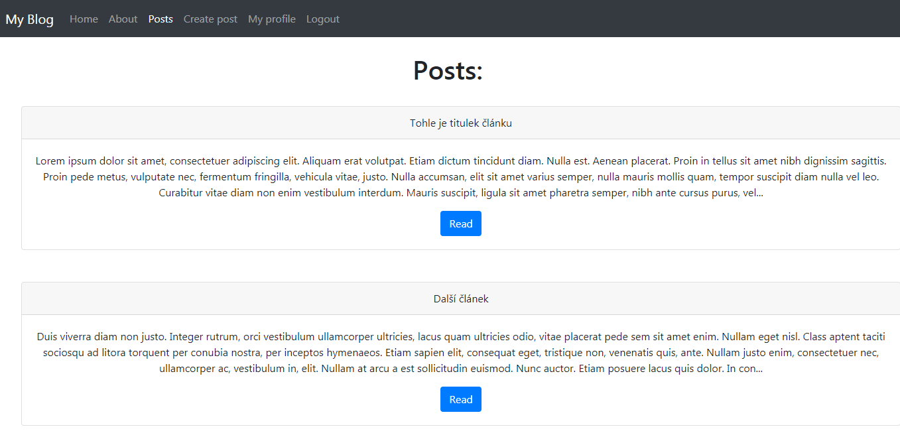
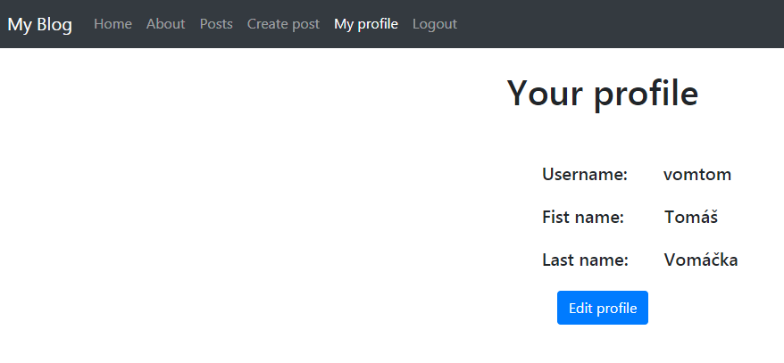

# Semestrální práce

## Multitenantní blog / fórum

Aplikace je dostupná [zde](https://sem-blog.herokuapp.com/) 
a pro její správné používání je nutné se registrovat a přihlásit.

Aplikace umožňuje přidávání vlastních článků, které jejich autor může editovat a případně i mazat. 
Jakýkoliv přihlášený uživatel může článek komentovat a tyto komentáře následně i mazat pojkud je jejich autorem.
Autor článku komentáře pod jeho článkem mazat nemůže.
Každý uživatel může editovat svůj účet.

## Použité technologie

- Java (backend)
- React (frontend)
- React bootstrap (frontend)
- SpringBoot (backend)
- Postgresql (databáze)
- Heroku (nasazení aplikace)

## Spuštění aplikace

Následující příkaz provede build frontend aplikace do backendu a aplikaci spustí. Pokud budete mít nastavené připojení na vlastní databázi 
a aplikace bude spuštěna na Vašem počítači, pokračujte prosím na [tuto](http://localhost:8080/) stránku, kde aplikaci můžete testovat.

```sh
gradle bootRun
```

V případě, že chcete spustit pouze frontend, musíte zadat v adresáři "frontend" příkaz níže.

```sh
npm start
```

### Uživatelé

Aplikace automaticky vytvoří dva uživatele, přes které se můžete přihlásit do aplikace.

Uživatel Tomáš Vomáčka:
- Uživatelské jméno: vomtom
- Heslo: password

Uživatelka Klára Novotná:
- Uživatelské jméno: novkla
- Heslo: password

## Adresářová struktura aplikace

 - /frontend obsahuje zdrojové soubory pro fronted 
 - /src obsahuje backend i s konfigurací databáze

## Schéma databáze



## Screenshoty aplikace

- Přidávání a editování článku.



- Detail článku včetně jednoho komentáře (přihlášen uživatel novkla).



- Detail komentářů s vykreslením tlačítka pro smazání podle autora komentáře (přihlášen uživatel barca).



- Nabídka článků k přečtení.



- Profil uživatele.

